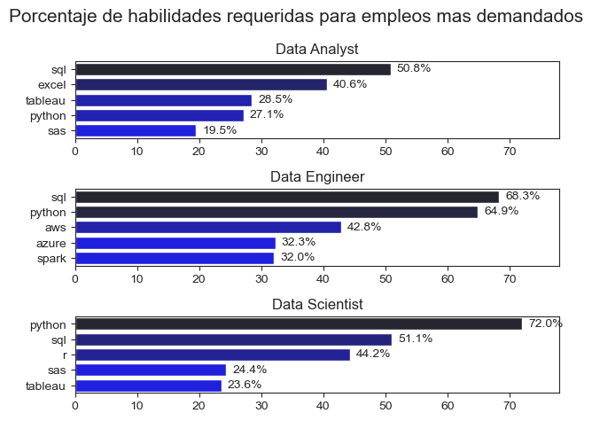
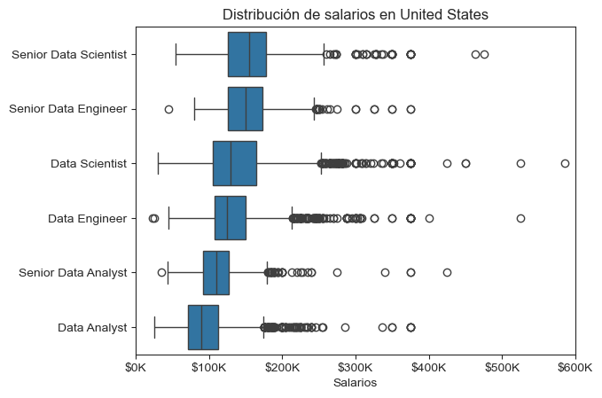
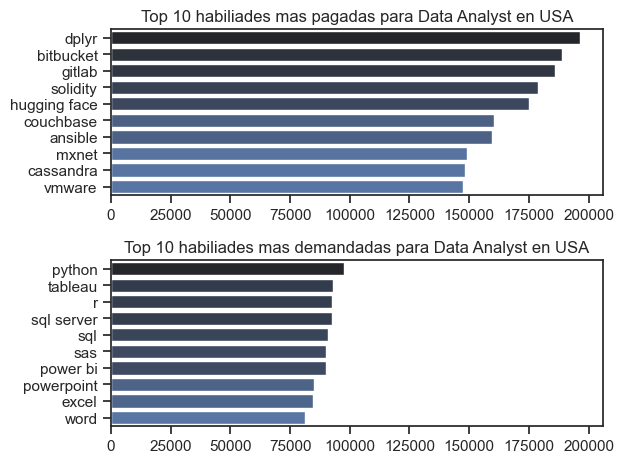
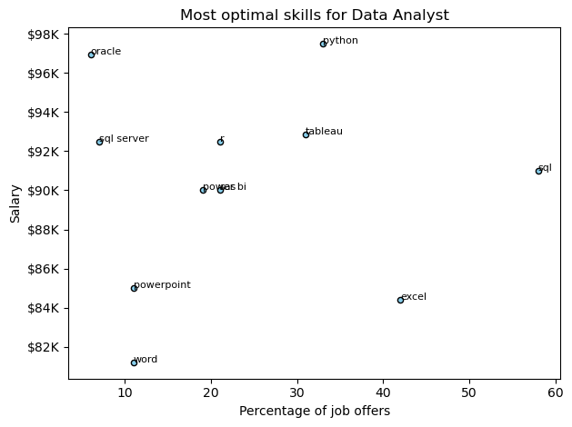

# Analysis

## 1. What are the most demanded skills for the top 3 most popular data roles?

To identify the most in-demand skills for the top three most popular data roles, I first filtered job postings to find the most frequently listed positions. Then, I extracted the top five skills associated with each of these roles. This analysis highlights the most sought-after job titles and their key skills, helping me understand which skills to focus on based on the roles I'm targeting.

View my notebook with detailed steps here:

[2_Skills_count.ipynb](2_Skills_count.ipynb)

### Visualize Data

```Python
fig, ax = plt.subplots(len(empleos), 1)

for i, empleo in enumerate(empleos):
    df_plot = df_merge[df_merge['job_title_short'] == empleo].head(5)

    #Usando seaborn
    sns.barplot(data = df_plot,
                x = '%',
                y = 'job_skills',
                ax = ax[i],
                legend = False,
                hue = '%',
                palette = 'dark:b_r')
    ax[i].set_xlabel('')
    ax[i].set_ylabel('')
    ax[i].set_title(empleo)
    ax[i].set_xlim(0, 78)

    # Agregar valores de datos para cada barra
    for index, valor in enumerate(df_plot['%']):
        ax[i].text(valor + 1, # + 1 es para alejar el valor de la barra ("valor" es un parametro que igual debe ir)
                    index,
                    f'{round(valor,1)}%',
                    va = 'center') # Para centrar el valor a la barra
    
fig.suptitle('Porcentaje de habilidades requeridas para empleos mas demandados', fontsize = 15)
sns.set_style('ticks')
plt.tight_layout()
plt.show()
```

### Results


### Insights
- Python is a versatile skill, highly demanded across all three roles, but most prominently for Data scientist (72%) and Data Engenierrs (65%).

- SQL is the most requested skills por Data Analyst and Data scientiest, with it in over half the job postings for both roles. For Data Engieneers, Python is the most sought-after skill, appearing in 68% of job postings.

- Data Engienners requiere more specialized technical skills (AWS, Azure, Spark) compared to Data Analysts and Data scientisest who are expected to be proficient in more general data management and analysis tools (Excel, Tableu).


## 2. How are in-demand skills trending for Data Analysts?

### Insights.
- SQL remains the most consistenly demanded skill throughout the year, although it shows a gradual decrease in demand.
- Excel experienced  a significal increce in demand starting around september, surpassing both Python and Tableu by the end of the year.
- Both Python and Tableu show relatively stable demand throughout the year with some flutuations but remain essential skills for Data analysts.

View my notebook with detailed steps here:

[3_Skills_Trend.ipynb](3_Skills_Trend.ipynb)

### Visualize Data
```Python
df_plot = df_DA_USA_percent.copy()

sns.lineplot(data = df_plot,
             dashes = False,
             palette = 'tab10',
             legend = False)
plt.title('Tendencia de habilidades para Data Analyst in USA')
plt.xlabel('2023')
plt.ylabel('Porcentaje')

# Especificar para cada linea si habilidad
for i in range(0, 5, 1):
    plt.text(11.2, df_plot.iloc[-1, i], df_plot.columns[i])

sns.set_style(style = 'ticks')
sns.despine()
plt.show()
```

## 3. How well do jobs and skills pay for Data Analysts?

### Salary Analysis

#### Insights
- Senior roles like Senior Data Scientist and Senior Data Engineer show the highest median salaries (over $150K), highlighting the value of experience and advanced technical skills in the data field.

- With a median around $90K–$100K, the Data Analyst role offers the lowest pay and the least variability. It's often a starting point but has limited salary growth compared to more technical paths.

- All roles, especially technical ones, include many outliers above $200K, with some reaching $500K+. This indicates exceptional earning opportunities for top performers or those in high-paying industries.

View my notebook with detailed steps here:

[4_Salary_Analysis.ipynb](4_Salary_Analysis.ipynb)

#### Visualize Data

```Python
sns.boxplot(data = df_US_top6,
            x = 'salary_year_avg',
            y = 'job_title_short',
            order = nombres_empleos)
sns.set_style(style = 'ticks')

plt.title('Distribución de salarios en United States')
plt.xlabel('Salarios')
plt.ylabel('')
plt.xlim(0, 600000)
ticks_x = plt.FuncFormatter(lambda y, pos: f'${int(y/1000)}K')
plt.gca().xaxis.set_major_formatter(ticks_x)
plt.show()
```

#### Results


*Box plot visualizing the salary distributions for the top 6 data job titles.*

### Highest Paid & Most Demanded Skills for Data Analysts

#### Insights
- dplyr stands out as the highest-paying skill, indicating that expertise in R for data manipulation can be highly valuable in niche roles.

- Less common tools like bitbucket, gitlab, solidity, and hugging face offer high salaries, likely due to a limited talent pool and specialized demand.

- High-paying skills are not necessarily in high demand — many of the top-paying technologies do not appear in the most in-demand list, highlighting a gap between specialization and market size.

- Python is the most in-demand skill, confirming its central role in the data analytics ecosystem.

- Business Intelligence and reporting tools (Tableau, Power BI, Excel, PowerPoint) dominate the demand list, showing the importance of communication and visualization in analytics roles.

- SQL remains a foundational skill for data analysts, with both SQL and SQL Server appearing among the top 5, reflecting the ongoing need to work with structured data sources.

#### Visualize Data

```Python
fig, ax = plt.subplots(2,1)

sns.set_theme(style = 'ticks')

# seaborn
sns.barplot(data = df_DA_USA_masPagadas,
            x = 'median',
            y = 'job_skills',
            ax = ax[0],
            hue = 'median',
            palette = 'dark:b_r',
            legend = False)

sns.barplot(data = df_DA_USA_masPopulares,
            x = 'median',
            y = 'job_skills',
            ax = ax[1],
            hue = 'median',
            palette = 'dark:b_r',
            legend = False)

ax[0].set_title('Top 10 habiliades mas pagadas para Data Analyst en USA')
ax[0].set_ylabel('')
ax[0].set_xlabel('')

ax[1].set_title('Top 10 habiliades mas demandadas para Data Analyst en USA')
ax[1].set_ylabel('')
ax[1].set_xlabel('')
ax[1].set_xlim(ax[0].get_xlim()) # Limitar eje x del grafico 2 automaticamente en base al eje x del grafico 1 

plt.tight_layout()
plt.show()
```

#### Results


*Two separate  bar graphs visualizing  the highest paid skills and most in-demand skills for Data analysts in the US.*

## 4. How well do jobs and skills pay for Data Analysts?

### Optimal skills Analysis

#### Insights
- Python offers the highest salary (~$98K) and is in high demand (~35%), making it a highly optimal skill.

- SQL is the most in-demand skill (57%) but offers a moderate salary ($91K).

- Oracle and SQL Server provide high salaries (~$97K and ~$93K) but are in low demand (~7–10%).

- Word and PowerPoint have both low demand (<15%) and the lowest salaries (~$81K–$85K).

View my notebook with detailed steps here:

[5_Optimal_Skills.ipynb](5_Optimal_Skills.ipynb)

#### Visualize Data

```Python
from matplotlib.ticker import FuncFormatter

df_DA_skills.plot(kind='scatter',
                  x='skill_count_percent',
                  y='median_salary',
                  color='skyblue',
                  edgecolor='black')

# Agregar etiquetas (sin evitar overlapping)
for i, skill in enumerate(df_DA_skills.index):
    x = df_DA_skills.iloc[i]['skill_count_percent']
    y = df_DA_skills.iloc[i]['median_salary']
    plt.text(x, y, skill, fontsize=8)

ax = plt.gca()
ax.yaxis.set_major_formatter(FuncFormatter(lambda y, pos: f'${int(y/1000)}K'))

plt.xlabel('Percentage of job offers')
plt.ylabel('Salary')
plt.title('Most optimal skills for Data Analyst')
plt.tight_layout()
plt.show()
```

#### Results


*Scatter plot visualizing the optimal skills for Data Analysts.*